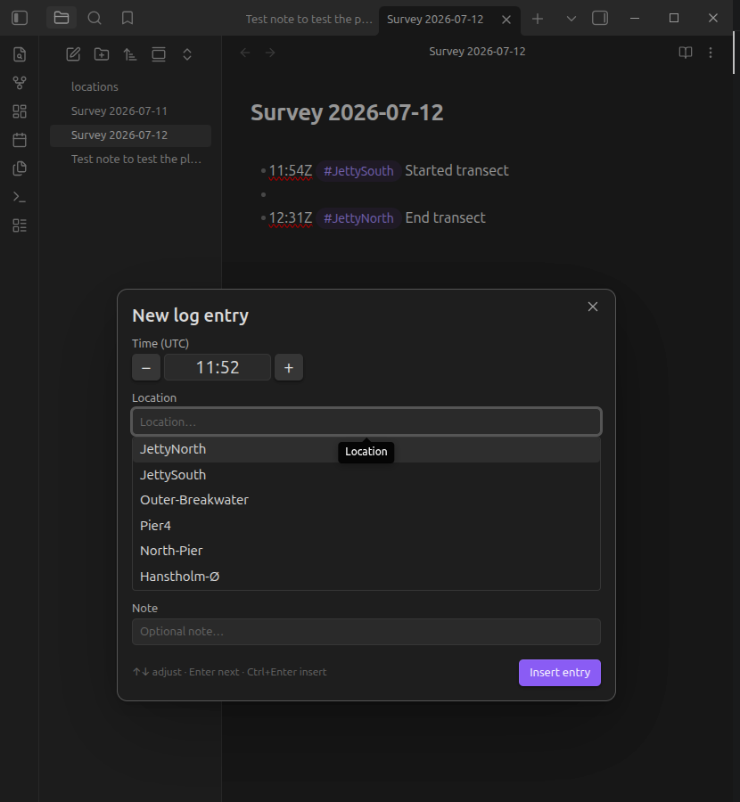

# Survey Log

An [Obsidian](https://obsidian.md) plugin for fast, keyboard-only creation of timestamped log entries while out on survey tasks.

Press one hotkey, nudge the pre-filled timestamp with arrow keys if needed, pick a location from an autocompleting list, optionally add a note (with suggestions from your own past entries), press Enter — and a clean, tagged log line lands in your active note:

```markdown
- 13:47Z #JettyNorth Started transect
- 13:52Z #JettyNorth Water sample taken
- 14:31Z #Pier4
```



Locations are inserted as normal Obsidian tags (default), so every entry for a location is findable through the tag pane, search, or Dataview — or as wikilinks (`[[Outer Breakwater]]`) if you prefer each location to be a note with a backlinks list of all its entries.

Locations you type that aren't in your list yet are appended to the locations file automatically (toggleable).

## Usage

1. Create a locations note in your vault (default path: `locations.md`), one location per line:

   ```markdown
   # Survey locations   <- "#" lines are ignored
   JettyNorth
   JettySouth
   Outer Breakwater     <- becomes #Outer-Breakwater
   Pier4
   ```

2. Assign a hotkey to **Survey Log: Create log entry** (Settings → Hotkeys).
3. Open the note you want to log into, hit the hotkey, and:
   - **Time** — pre-filled with the current time (`HH:mm`). `↑`/`↓` = ±1 minute, `Shift+↑`/`↓` = ±10 minutes, or type over it. On mobile use the `+`/`−` buttons.
   - **Location** — pre-filled with your last-used location (fully selected: plain `Enter` reuses it, typing replaces it). Suggestions filter as you type; `↑`/`↓` + `Enter`/`Tab` to pick. Unknown locations are allowed and sanitized into valid tags.
   - **Note** — optional free text. Suggestions come from note texts of your previous entries, most frequent first; `↓` to highlight one, `Enter` to accept it, `Enter` again to insert.
   - `Ctrl/Cmd+Enter` inserts from anywhere in the modal; `Esc` cancels.

## Settings

| Setting | Description | Default |
|---|---|---|
| Timezone | UTC timestamps get a `Z` suffix (`13:47Z`) so entries are self-describing | UTC |
| Locations file | Vault path of the note listing your locations | `locations.md` |
| Location style | Tag (`#JettyNorth`) or wikilink (`[[JettyNorth]]`) | Tag |
| Tag prefix | Optional prefix, e.g. `loc/` → `#loc/Pier4` (tag style only) | *(empty)* |
| Auto-add new locations | Append unknown locations to the locations file on insert | On |
| Insert position | End of note, or at the cursor | End of note |
| Note suggestions from | Whole vault or current note only | Whole vault |
| Pre-fill last-used location | Reuse the previous location with a single Enter | On |

## Installation

### Manual

Download `main.js`, `manifest.json`, and `styles.css` from the latest [release](../../releases) into `<vault>/.obsidian/plugins/survey-log/`, then enable the plugin in Settings → Community plugins.

### From source

```bash
git clone <this repo>
cd survey-log-obsidian-plugin
npm install
npm run build
```

Copy (or symlink) the repo folder to `<vault>/.obsidian/plugins/survey-log/` — the folder name must be exactly `survey-log`.

## Development

```bash
npm install
npm run dev     # esbuild watch mode
npm test        # vitest unit tests (pure logic: time math, parsing, ranking)
npm run lint    # eslint
npm run build   # type check + production bundle
```

Use a dedicated dev vault with the [Hot-Reload](https://github.com/pjeby/hot-reload) plugin for a fast feedback loop. Note that changes to `manifest.json` require an app restart; source changes only need a plugin reload.

Releases are fully automated: **every push to `main`** runs tests + build, bumps the patch version (`manifest.json`, `versions.json`, and `package.json` via `npm version` / `version-bump.mjs`), tags it, and publishes a GitHub release with `main.js`, `manifest.json`, and `styles.css` attached. For a minor or major bump instead, include `#minor` or `#major` in the commit message. Tags carry no `v` prefix (Obsidian convention, enforced via `.npmrc`).

## License

[MIT](LICENSE)
